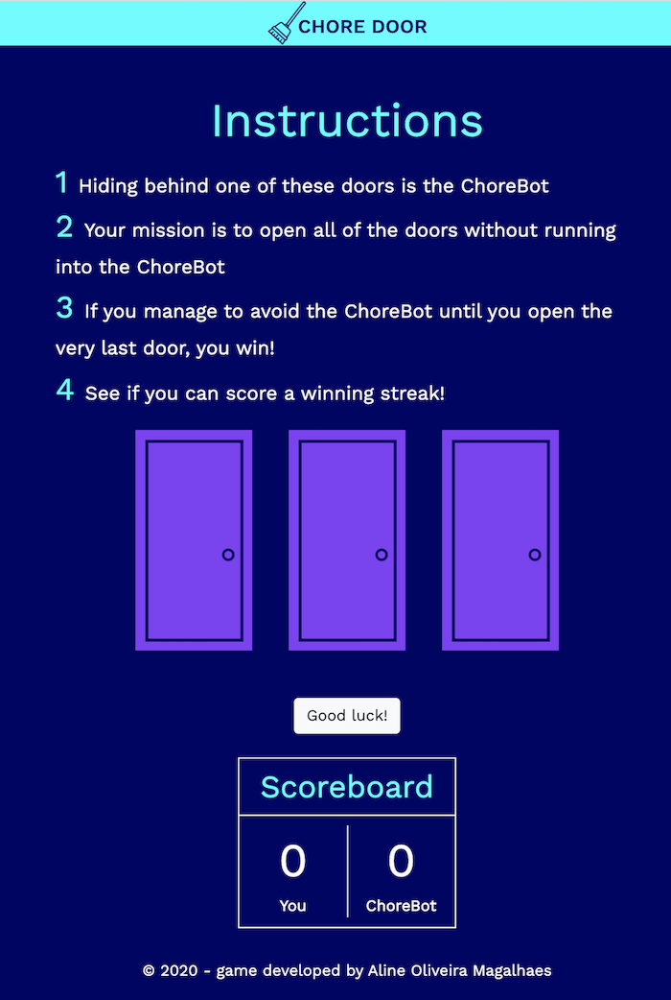
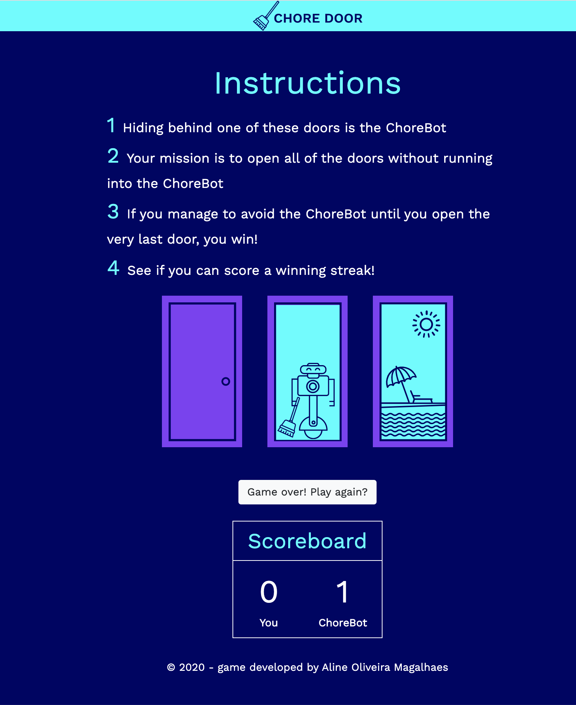
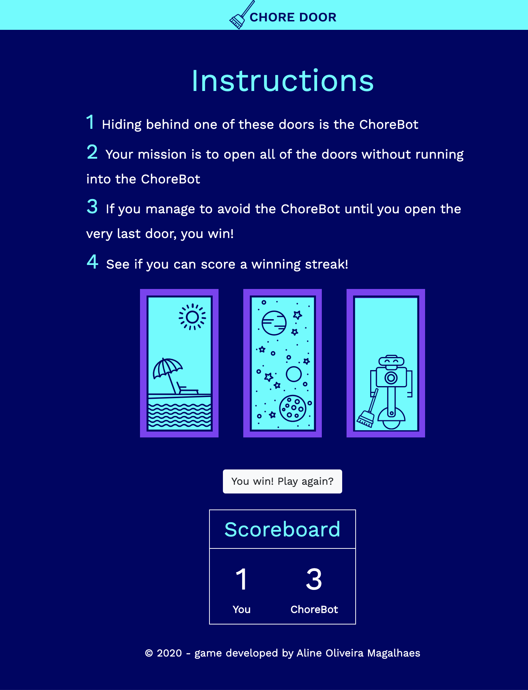

## Chore Door

My mission was to construct a single-page website that plays a fully-functional game.

Follow the link below to see what your game will look like by the end of this project. Play a few rounds and see how you fare against the ChoreBot:

[Chore Door](https://s3.amazonaws.com/codecademy-content/projects/chore-door/chore-door-final/index.html)

### Rules

1. Hiding behind one of these doors is the ChoreBot;
2. Your mission is to open all of the doors without running into the ChoreBot;
3. If you manage to avoid the ChoreBot until you open the very last door, you win!
4. See if you can score a winning streak!

#### Languages
 * HTML
 * JavaScript
 * CSS

 #### CSS framework
 * Bootstrap 4.5

 #### Images

