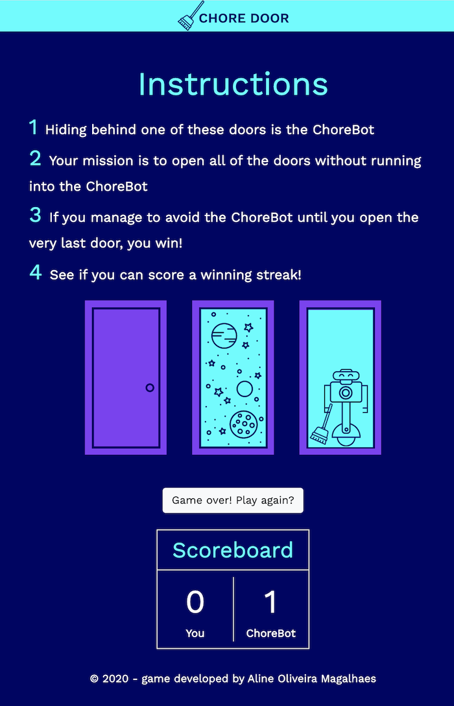
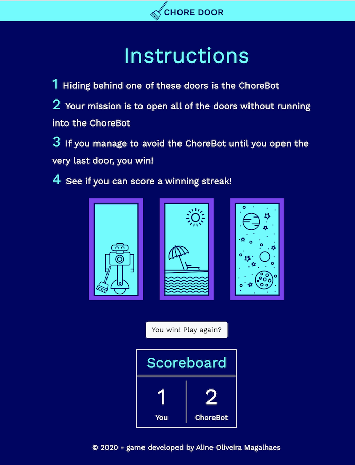

## Chore Door

Chore Door is a single-page website that plays a fully-functional game.

Click on the link below to play a few rounds and see how you fare against the ChoreBot:

[Chore Door](https://aoliveiramagalhaes.github.io/chore-door)

### Rules

1. Hiding behind one of these doors is the ChoreBot;
2. Your mission is to open all of the doors without running into the ChoreBot;
3. If you manage to avoid the ChoreBot until you open the very last door, you win!
4. See if you can score a winning streak!

#### Languages
 * HTML
 * JavaScript
 * CSS

 #### CSS framework
 * Bootstrap 4.5

 #### PWA
 Chore Door supports PWA, so I built my PWA to bring an awesome "install" experience to users. With only one click they can install my *Progressive Web App* directly from the browser.

 #### Images

